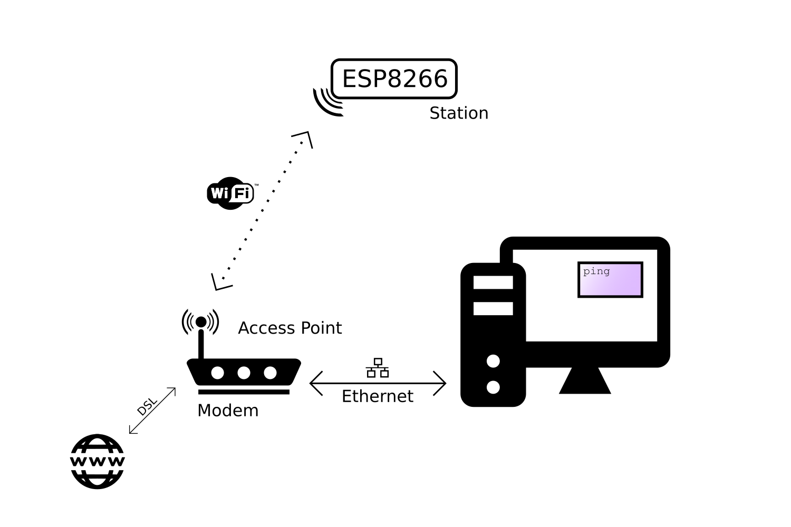

# Kiezen bord

Kies na het toevoegen van de nodige bibliotheken voor het LOLIN (WEMOS) D1 R2 & mini board.


# Knipperled

Plaats een led op GPIO16 en test onderstaande programma.

```cpp
// Blink
void setup() {
  // initialize GPIO16 as an output.
  pinMode(16, OUTPUT);
}

// the loop function runs over and over again forever
void loop() {
  digitalWrite(16, HIGH); // turn the LED on (HIGH is the voltage level)
  delay(1000);            // wait for a second
  digitalWrite(16, LOW);  // turn the LED off by making the voltage LOW
  delay(1000);            // wait for a second
}
```

## Opdrachten

* Laat de ingebouwde LED op het bord knipperen. De ingebouwde LED op het bord is verbonden met GPIO14. 
* Laat een LED knipperen op een andere I/O pin. 

# Knipperled met alternatieve pinnummering

In bovenstaande voorbeeld moet de gebruikte pinnummering steeds vergeleken worden met het overzicht. De gebruikte pinnummers zoals pin 16 in bovenstaande voorbeeld worden niet weergegeven op het WEMOS D1R2 bord.

De I/O pinnummers weergegeven op het WEMOS D1R2 bord kunnen eveneens gebruikt worden. Zie onderstaande voorbeeld programma waarbij een led verbonden is met pin D0.

```cpp
// Blink
void setup() {
  // initialize GPIO16 as an output.
  pinMode(D0, OUTPUT);
}

// the loop function runs over and over again forever
void loop() {
  digitalWrite(D0, HIGH); // turn the LED on (HIGH is the voltage level)
  delay(1000);            // wait for a second
  digitalWrite(D0, LOW);  // turn the LED off by making the voltage LOW
  delay(1000);            // wait for a second
}
```

#	Weergave tekst in serial monitor

In volgende programma wordt een tekst weergegeven in de serial monitor. Let op de bit snelheid. 

```cpp
void setup() {
   Serial.begin(115200);
 }
 
void loop() {
  delay(1000);
  Serial.println("hello from ESP8266");
 }
```

# Weergave MAC-adres

Het MAC-adres is het fysisch adres van een toestel in het netwerk. (zowel bedraad als draadloos) 

```cpp
#include <ESP8266WiFi.h> //ESP8266Wifi library
 
void setup(){
   Serial.begin(115200); // Communicatie snelheid UART
}
 
void loop(){
   Serial.print("MAC: ");
   Serial.println(WiFi.macAddress()); //Weergave MAC adres via methode macAdress()
   delay(1000);
}

```

Via volgende website kan nagezien worden van welke fabrikant een MAC-adres afkomstig is: [Weergave MAC-adres](https://wintelguy.com/index.pl) 
 
# Verbinden met Wifi-netwerk

In volgende programma wordt de ESP8266 verbonden met het access point in het Wifi-netwerk.



De voorbeeldcode:

```cpp
#include <ESP8266WiFi.h>        // Include the Wi-Fi library

const char* ssid     = "SSID";         // The SSID (name) of the Wi-Fi network you want to connect to
const char* password = "PASSWORD";     // The password of the Wi-Fi network

void setup() {
  Serial.begin(115200);         // Start the Serial communication to send messages to the computer
  delay(10);
  Serial.println('\n');
  
  WiFi.begin(ssid, password);             // Connect to the network
  Serial.print("Connecting to ");
  Serial.print(ssid); Serial.println(" ...");

  int i = 0;
  while (WiFi.status() != WL_CONNECTED) { // Wait for the Wi-Fi to connect
    delay(1000);
    Serial.print(++i); Serial.print(' ');
  }

  Serial.println('\n');
  Serial.println("Connection established!");  
  Serial.print("IP address:\t");
  Serial.println(WiFi.localIP());         // Send the IP address of the ESP8266 to the computer
}

void loop() { }

```

# Status Wifi verbinding

Het is mogelijk de status van de wifi verbinding na te zien. Voeg hiervoor volgende code toe in de loop functie van voorgaande programma.

```cpp
  Serial.printf("\nConnection status: %d\n", WiFi.status());
  Serial.print("Connected, IP address: ");
  Serial.println(WiFi.localIP());
  delay(1000);
```

Hierbij komt is:
- 3 verbonden
- 6 niet verbonden.

# Signaalsterkte

De sterkte van het Wifi signaal (RSSI Received Signal Strength Indication) kan weergegeven worden met volgende code:

```cpp
Serial.printf("RSSI: %d dBm\n", WiFi.RSSI());
```

# Weergave tijd

De tijd kan opgehaald worden van een NTP Server. (Network Time Protocol) De communicatie verloopt normaal over poort 123 met het UDP protocol.

Hiervoor moet eerst de ntpclient bibliotheek toegevoegd worden van Fabrice Weinberg.

De voorbeeldcode:

```cpp
#include <NTPClient.h>
#include <ESP8266WiFi.h>
#include <WiFiUdp.h>

const char *ssid     = "YOUR_SSID";
const char *password = "YOUR_PASS";

const long utcOffsetInSeconds = 3600;

char daysOfTheWeek[7][12] = {"Sunday", "Monday", "Tuesday", "Wednesday", "Thursday", "Friday", "Saturday"};

// Define NTP Client to get time
WiFiUDP ntpUDP;
NTPClient timeClient(ntpUDP, "pool.ntp.org", utcOffsetInSeconds);

void setup() {
  Serial.begin(115200);

  WiFi.begin(ssid, password);

  while ( WiFi.status() != WL_CONNECTED ) {
    delay ( 500 );
    Serial.print ( "." );
  }
  timeClient.begin();
}

void loop() {
  timeClient.update();
  Serial.print(daysOfTheWeek[timeClient.getDay()]);
  Serial.print(", ");
  Serial.print(timeClient.getHours());
  Serial.print(":");
  Serial.print(timeClient.getMinutes());
  Serial.print(":");
  Serial.println(timeClient.getSeconds());
  delay(1000);
}
```