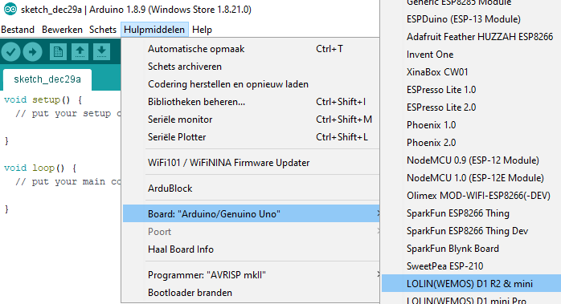

# Kiezen bord

Kies na het toevoegen van de nodige bibliotheken voor het LOLIN (WEMOS) D1 R2 & mini board.



# Knipperled

Plaats een led op GPIO16 en test onderstaande programma.

```cpp
// Blink
void setup() {
  // initialize GPIO16 as an output.
  pinMode(16, OUTPUT);
}

// the loop function runs over and over again forever
void loop() {
  digitalWrite(16, HIGH); // turn the LED on (HIGH is the voltage level)
  delay(1000);            // wait for a second
  digitalWrite(16, LOW);  // turn the LED off by making the voltage LOW
  delay(1000);            // wait for a second
}
```

## Opdrachten

* Laat de ingebouwde LED op het bord knipperen. De ingebouwde LED op het bord is verbonden met GPIO14. 
* Laat een LED knipperen op een andere I/O pin. 

#	Weergave tekst in serial monitor

In volgende programma wordt een tekst weergegeven in de serial monitor. Let op de bit snelheid. 

```cpp
void setup() {
   Serial.begin(115200);
 }
 
void loop() {
  delay(1000);
  Serial.println("hello from ESP8266");
 }
```

# Weergave MAC-adres

Het MAC-adres is het fysisch adres van een toestel in het netwerk. (zowel bedraad als draadloos) 

```cpp
#include <ESP8266WiFi.h> //ESP8266Wifi library
 
void setup(){
   Serial.begin(115200); // Communicatie snelheid UART
}
 
void loop(){
   Serial.print("MAC: ");
   Serial.println(WiFi.macAddress()); //Weergave MAC adres via methode macAdress()
   delay(1000);
}

```

Via volgende website kan nagezien worden van welke fabrikant een MAC-adres afkomstig is: [Weergave MAC-adres](https://wintelguy.com/index.pl) 
 