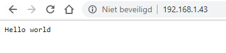
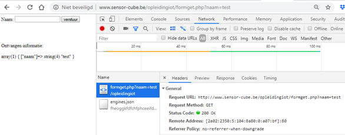
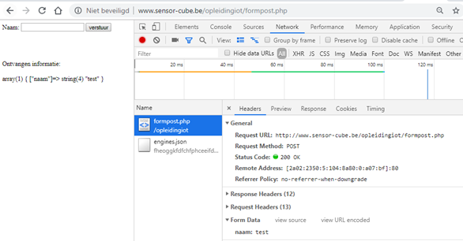

# HTTP en HTML
## HTTP

HTTP staat voor Hyper Text Transfer Protocol. HTTP is ontworpen voor communicatie tussen client en server. Met een browser zoals chome of firefox (de client) is het mogelijk webpagina’s op te vragen op een ESP8266. (server)



## HTTP request

Als je in de adresbalk van je webbrowser een bepaalde website opvraagt, dan wordt er van de client naar de server een http request gestuurd. Er bestaan verschillende request methodes zoals GET, POST,PUT,... In de cursus wordt enkel GET en POST gebruikt.

[Voorbeeld GET met php bestand](http://www.sensor-cube.be/opleidingiot/formget.php)

Via het php bestand formget.php kan je informatie doorgeven via GET. Test dit uit. 

Wanneer je het woord test meegeeft krijg je volgende URL:

[http://www.sensor-cube.be/opleidingiot/formget.php?naam=test](http://www.sensor-cube.be/opleidingiot/formget.php?naam=test)

Via functietoets F12 op het toetsenbord kan meer info weergegeven worden in de browser.



[Voorbeeld POST met php bestand](www.sensor-cube.be/opleidingiot/formpost.php)

Via het php bestand formpost.php wordt informatie verstuurd. Test dit uit.



##	Http-response

Een typische http-response van de server naar de client ziet er als volgt uit:

```HTML
HTTP/1.0 200 OK
Content-Type:text/plain
Alles goed?
```

Of
```HTML
HTTP/1.0 200 OK
Content-Type:text/html
<html>
<h1>Hello from ESP8266 </h1>
</html>
```
Een http-response die de server naar de client stuurt, geeft informatie mee die de client kan gebruiken om de content correct weer te geven.
De status lijn “HTTP/1.0 200 OK” of “HTTP/1.1 200 OK” moet altijd minimaal in de http response staan.
* HTTP/1.0 geeft de gebruikte versie van http aan. Enkel versie 1.0, 1.1 en 2.0 worden nog ondersteund.
* 200 is een code die de status van de opgevraagde data weergeeft.

Een overzicht van veel voorkomende statuscodes:
* 200 OK - succesvol opgevraagde content
* 301 Moved Permanently – de content moet via de nieuwe URL gehaald worden
* 400 Bad Request - de request bevat fouten
* 404 Not Found - de opgevraagde content bestaat niet
* 500 Internal Server Error - server foutje