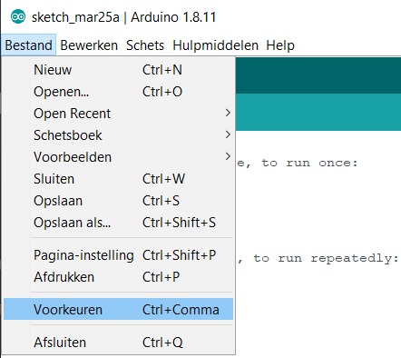

# Inleiding

De ESP8266 is een goedkope 32 bit microcontroller met Wi-Fi mogelijkheid. De ESP8266 is ontwikkeld en wordt geproduceerd door de Chinese fabrikant Espressif Systems.
In de cursus wordt gebruik gemaakt van het WEMOS D1 R2 ontwikkelbord van RobotDyn met dezelfde lay-out als een Arduino Uno. 


## Toevoegen van de nodige bibliotheken aan Arduino IDE

De ESP8266 is niet standaard aanwezig in Arduino IDE. Er moeten extra bibliotheken toegevoegd worden.

Kies in het menu "Bestand" voor "Voorkeuren".


Voeg volgende URL toe:
```url 
http://arduino.esp8266.com/stable/package_esp8266com_index.json
```


Kies vervolgens in het menu "Hulpmiddelen" voor "Board: " en kies "Board Beheer ..."


Zoek ESP8266 en installeer.


Zoek op wat de I/O spanning is van de ESP8266.