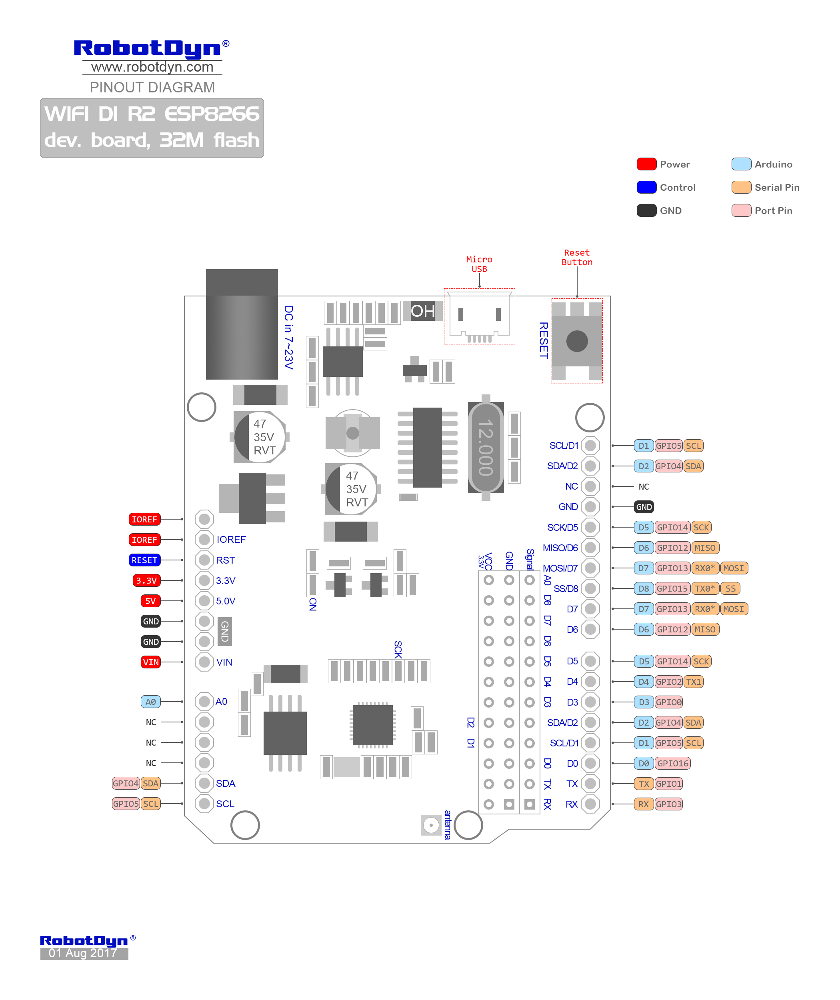

# Pinlayout en specificaties

De I/O pinnen zitten niet op dezelfde plaats als bij de Arduino Uno. Op onderstaande figuur is een overzicht te vinden.

De belangrijkste specificaties van het bord zijn:

| Omschrijving |Specificatie |
| :-------------: |:-------------:|
| Microcontroller | ESP8266 | 
| USB-TTL converter |CH340C| 
| Power Out 3,3 V | 800mА |
| Power Out 5 V | 800mА | 
| Power IN. USB | 5V (500mA max.) | 
| Power IN. VIN/DC Jack | 9-24V | 
| Wifi | Wi-Fi 802.11 b/g/n 2.4 GHz | 
| USB | Micro USB | 
| Operating Supply Voltage | 3.3V | 
| Digital I/O | 11 | 
| Analog I/O | 1 | 
| Antenna | Buil-in\external antenna | 

Bron: [RobotDyn](https://robotdyn.com/wifi-d1-r2-esp8266-dev-board-32m-flash.html)